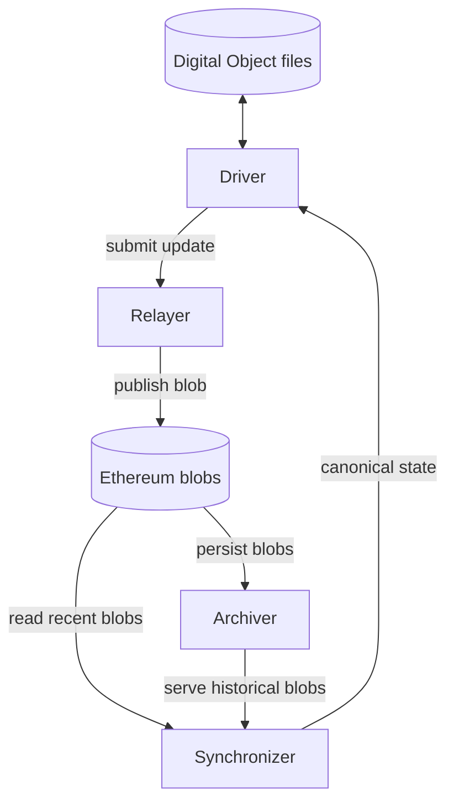

# DON Architecture

This document outlines the overall architecture of the network and how
operationally you can realize the guarantees outlined in the
[network overview](/network).

## Digital Object (DO)

A **Digital Object** (DO) is a file with four parts:

- **State** — the object's current data, of arbitrary structure and size.
- **Code** — the rules that govern how the state may change, and the conditions under which the object may be created or destroyed.
- **Proof** — evidence that every state change in the object's history followed the rules in its code.
- **Commitment** — a public record, posted on the network's broadcast channel, that commits to the object's current state without revealing it.

**Lifecycle.** An object is _created_, _transitioned_ any number of times, and eventually _consumed_. Each transition consumes the object's current commitment and publishes its successor in the same step, so the object stays **live** throughout, represented at any moment by a single current commitment.

## Network Architecture

Five components together make the network work.

### Ethereum Blobs

The network uses Ethereum blobs as its public broadcast channel. Blobs are append-only, publicly readable payloads attached to Ethereum consensus blocks: anyone may post one, anyone reading the chain receives them in canonical order, and once a blob has been included in a finalized block its place in history cannot be rewritten.

Blob data is retained directly by Ethereum consensus nodes for a limited window (roughly 18 days). The cryptographic commitment to each blob, however, lives permanently in its containing block header. The Archiver closes the resulting gap between permanent ordering and bounded data retention.

### Archiver

A service that reads blobs from Ethereum while they are still available and stores their payloads durably. Its role is data availability: synchronizers bootstrapping for the first time, or recovering from a long outage, need blob payloads from beyond Ethereum's retention window, and the Archiver supplies them.

The Archiver requires no trust: its output is verifiable against the permanent blob commitments in Ethereum block headers, so a faulty or dishonest Archiver cannot inject false history. Anyone may run one, and any number may operate concurrently.

### Synchronizer

A service that reads Ethereum blobs — recent ones directly from the chain, older ones from the Archiver — and from them reconstructs the canonical global state: two append-only sets, the commitments that have been published and the nullifiers that mark commitments as consumed. A commitment is live until a nullifier is posted, and the order in which nullifiers are published settles any double spend.

The synchronizer holds no secrets. Anyone with blob data can run their own synchronizer and arrive at the same answer. A single honest synchronizer is sufficient for the network to be live.

### Relayer

A service that takes proposed digital object updates and submits them to Ethereum as blob payloads. The relayer is not trusted with object contents, it sees only the same opaque commitments and consumptions that will appear on-chain. Its job is convenience and availability: clients who do not want to maintain an Ethereum signer or pay gas directly can submit through any relayer they choose.

### Driver

A service that manages the digital objects themselves. The driver stores object files, runs the code that transitions them, produces the evidence each transition requires, talks to the relayer to publish an update, and talks to the synchronizer to verify the status of objects (live or consumed).

The Driver holds the only copy of an object's contents; no other component stores them. If a holder loses their object file, the object is gone. Its commitment still shows as live on-chain, but the state needed to use it existed only in that file.

## Clients

A _client_ is a deployment a user assembles from these components. Every component except the Driver has no special access: none holds object contents and each is a deterministic function of public data.

They differ, though, in how cheaply their output can be checked — the Archiver's can be verified one blob at a time against its on-chain commitment, while the Synchronizer's global state can only be checked by re-deriving it from the blobs yourself (i.e. running one).

A user is therefore free to run as much or as little infrastructure as they like and delegate the rest to hosted services, trading operational cost against how little they have to trust.

Three different configurations on that spectrum are:

### 1. Full node — run everything

Run the Driver, Relayer, Synchronizer, and Archiver yourself, backed by your own Ethereum node. Reading blobs requires a consensus-layer beacon node while submitting blobs and reading block headers requires an execution node and a signer.

- **Trust:** nothing but Ethereum itself, namely that it keeps producing finalized blocks and does not reorganize finalized history.
- **Guarantees:**
  - You read blobs first-hand and run your own synchronizer over them, so the canonical state is computed from data you obtained yourself, giving you **consistency** and **no double spend** (no object can be spent twice).
  - You submit your own blobs through your own signer, so you **cannot be censored**.
  - You run your own archiver, so your **data availability** never depends on anyone else — you can bootstrap and recover entirely on your own.
  - **Integrity** and **privacy** hold as they always do: the Driver verifies every proof locally, and object contents never leave your machine.

This is the heaviest deployment and the only one that depends on no third party.

### 2. Light client — Driver only

Run only the Driver, pointed at hosted relayer, synchronizer, and archiver endpoints, which read and write Ethereum on your behalf. This is the lightest possible client.

What you keep because the Driver is local:

- **Privacy** — object contents and code never leave your machine. Every hosted service sees only the opaque commitments and consumptions that appear on-chain.
- **Integrity** — the Driver verifies the proof of every object you accept, so whoever sends you an object cannot give you one with invalid history without you detecting it.
- **Local autonomy** — you run transitions and produce verifiable presentations of your objects entirely on your own machine.

What you now **trust**:

- The **synchronizer** for **consistency** and **no double spend**. You take its word for which objects are live and which are consumed; a dishonest one could misreport canonical state — for instance, claim an object you are about to receive is still live after it was consumed.
- The **relayer** for **censorship-resistance**. It cannot read or forge your objects, but it can drop or delay your updates and stop you from publishing.
- The **archiver** for **availability**. Its output is checked so it cannot inject false history, but if it is unavailable while you bootstrap or recover, you cannot obtain historical blobs.

### 3. Contributing client — Driver + Archiver (+ Relayer)

Another possible configuration is to run the Driver and your own Archiver, and optionally your own Relayer. Your archiver needs blob reads, which it can get from your own beacon node or from a hosted beacon endpoint — because blob data is self-verifying against block-header commitments, reading it from a hosted endpoint adds no correctness trust, only a dependency on that endpoint for the read path.

Running an archiver makes you one of the _N_ parties keeping the network's history available — the way a seeder keeps a torrent alive. Over the light client you gain:

- **Self-sufficient availability** — your bootstrap and recovery no longer depend on any hosted archiver; historical blobs are in your own hands.
- **You add availability to the network** — others can now read history from you, strengthening the network overall.

Running your own relayer or signer adds **censorship-resistance**: you submit your own blobs, so no hosted relayer can drop or delay your updates. What still depends on a hosted service is the **synchronizer** for **consistency** and **no double spend**.

## Interfaces

The Driver exposes a uniform API, so it can be driven through any interface — a command-line tool, a desktop or web GUI, an automated agent, or another program.

Generating the zero-knowledge proof for each transition is the one computationally significant step, but it can be run on any modern consumer laptop — no specialized hardware, GPU, or server required.
